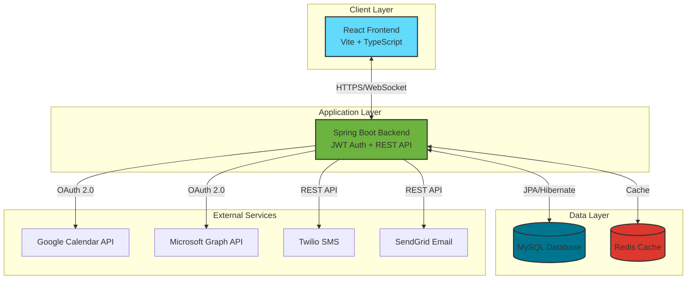
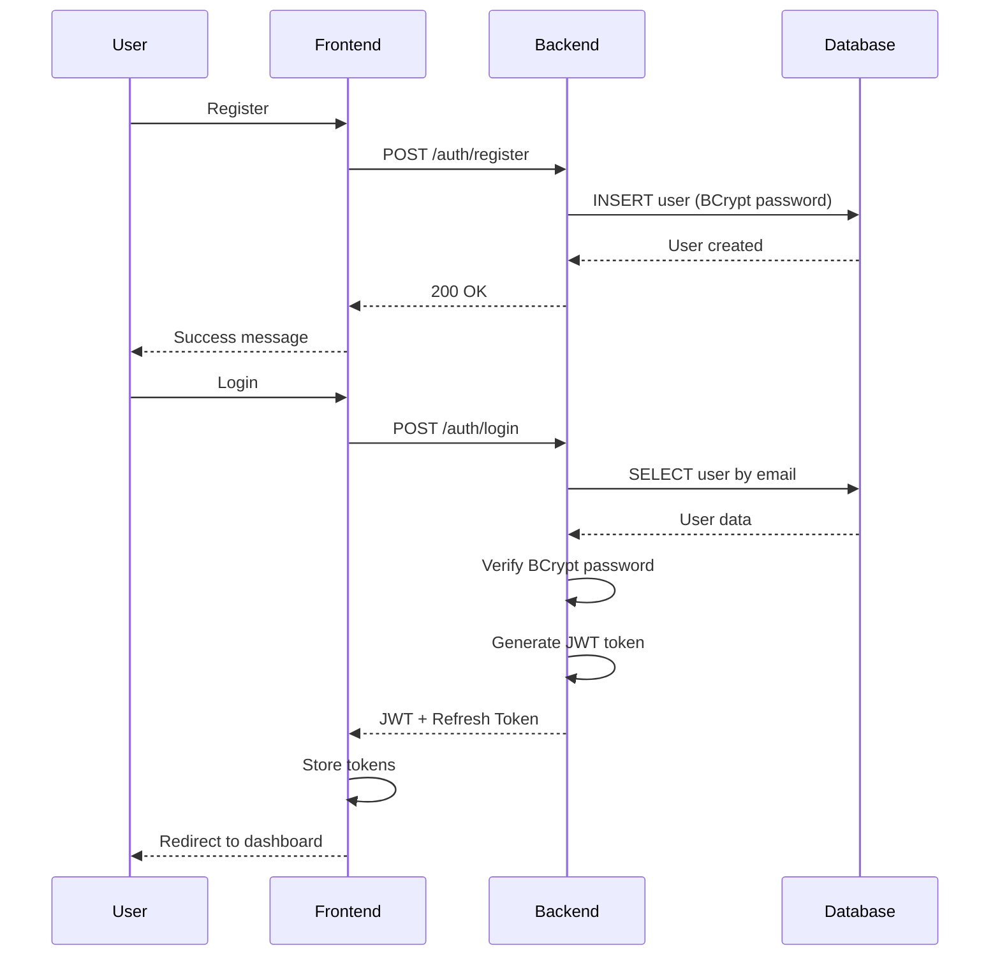
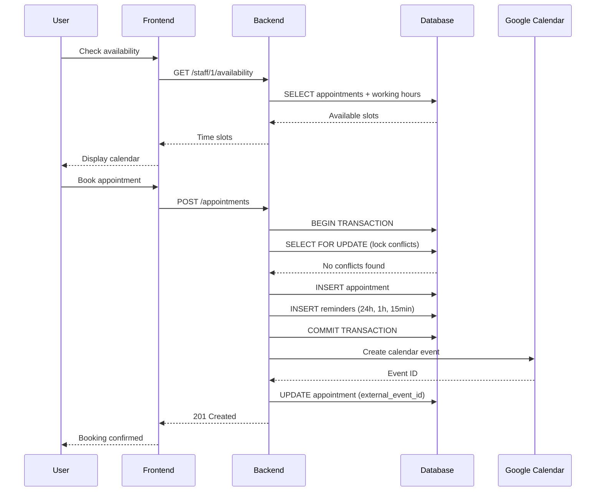
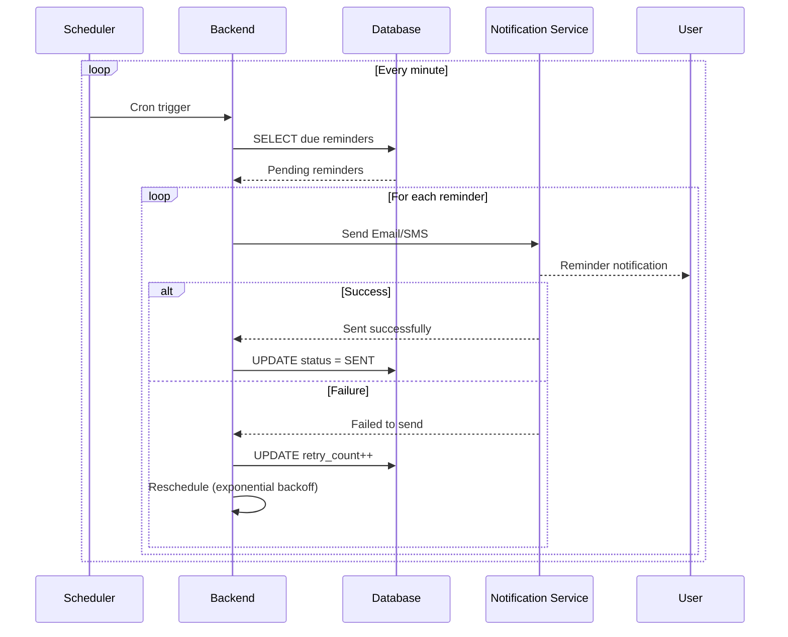

<div align="center">

# 📅 Appointment Scheduling System

### *A Modern, Full-Stack Appointment Management Platform*

[](https://www.oracle.com/java/)
[](https://spring.io/projects/spring-boot)
[](https://reactjs.org/)
[](https://www.typescriptlang.org/)
[](https://www.mysql.com/)

[](https://sonarcloud.io/summary/new_code?id=saad-g3_tp)
[](https://sonarcloud.io/summary/new_code?id=saad-g3_tp)
[](https://sonarcloud.io/summary/new_code?id=saad-g3_tp)
[](https://sonarcloud.io/summary/new_code?id=saad-g3_tp)
[](https://sonarcloud.io/summary/new_code?id=saad-g3_tp)

*A comprehensive appointment scheduling solution for clinics, salons, consultants, and coworking spaces with calendar integrations, real-time updates, and automated reminders.*

[Features](#-features) • [Quick Start](#-quick-start) • [API Docs](#-api-endpoints) • [Contributing](#-support)

</div>

---

## 🚀 Quick Start

### ⚡ One-Command Setup

**Windows Users:**
```bash
start.bat
```

**Mac/Linux Users:**
```bash
docker-compose up -d
```

🎉 **That's it!** Open http://localhost:5173 in your browser.

> 📖 **For detailed setup instructions, see [SETUP.md](./SETUP.md)**

---

## 🏗️ Architecture Overview

### 🔄 System Architecture



### 💻 Technology Stack

<table>
<tr>
<td width="50%">

#### Backend
- ☕ **Java 17+** - Modern Java features
- 🍃 **Spring Boot 3.x** - Application framework
- 🔐 **Spring Security** - JWT authentication
- 💾 **Spring Data JPA** - Database access
- 🦅 **Flyway** - Database migrations
- 🎯 **Lombok** - Boilerplate reduction
- 📡 **WebSocket** - Real-time updates

</td>
<td width="50%">

#### Frontend
- ⚛️ **React 18+** - UI library
- 📘 **TypeScript** - Type safety
- ⚡ **Vite** - Build tool
- 🎨 **Tailwind CSS** - Styling
- 🌐 **Axios** - HTTP client
- 🚦 **React Router** - Navigation

</td>
</tr>
<tr>
<td width="50%">

#### Database & Cache
- 🐬 **MySQL 8.0+** - Primary database
- 🗄️ **phpMyAdmin** - DB management
- 🔴 **Redis** - Caching layer

</td>
<td width="50%">

#### DevOps & Quality
- 🐳 **Docker** - Containerization
- 🔄 **GitHub Actions** - CI/CD
- 📊 **SonarCloud** - Code quality
- 🧪 **JUnit 5** - Testing framework

</td>
</tr>
</table>

---

## ✨ Features

### 🎯 Core Functionality
<table>
<tr>
<td width="50%">

- ✅ **Authentication & Authorization**
  - JWT-based secure authentication
  - Role-based access control (USER, STAFF, ADMIN)
  - Password encryption with BCrypt
  - Token refresh mechanism

- ✅ **Appointment Management**
  - Full CRUD operations
  - Real-time conflict detection
  - Atomic booking with SELECT FOR UPDATE
  - Optimistic locking for data integrity

- ✅ **Staff Management**
  - Profile creation and editing
  - Working hours configuration
  - Break time scheduling
  - Availability calculation

</td>
<td width="50%">

- ✅ **Smart Scheduling**
  - Real-time availability checking
  - Timezone support (UTC storage)
  - Service duration handling
  - Buffer time between appointments

- ✅ **Notification System**
  - Automated email reminders
  - SMS notifications via Twilio
  - Configurable reminder timing (24h, 1h, 15min)
  - Retry mechanism for failed deliveries

- ✅ **Analytics & Reporting**
  - Admin dashboard with metrics
  - Staff workload analysis
  - Booking trends and statistics
  - Activity logging

</td>
</tr>
</table>

### 🔗 Integration Features
- 📅 **Google Calendar** - Bidirectional sync with OAuth 2.0
- 📆 **Microsoft Outlook** - Office 365 integration
- 🔄 **Webhook Support** - Real-time external calendar updates
- 🚫 **Duplicate Prevention** - Smart conflict detection
- 🔔 **Real-time Updates** - WebSocket-based notifications

### 🛡️ Security & Quality
- 🔐 **JWT Authentication** with secure token management
- 🛡️ **CORS Configuration** for secure cross-origin requests
- 📊 **Code Quality** monitored by SonarCloud
- 🧪 **Test Coverage** at **44.57%** with 57 unit tests
- ✅ **Quality Gate** passing with A ratings

---

## 📊 Code Quality Metrics

<div align="center">

### 🎯 SonarCloud Analysis Results

| Metric | Status | Details |
|--------|--------|---------|
| **Quality Gate** | ✅ **Passed** | All criteria met |
| **Coverage** |  | 57 unit tests |
| **Security** |  | No vulnerabilities |
| **Reliability** |  | No bugs |
| **Maintainability** |  | No code smells |

📈 **View detailed analysis:** [SonarCloud Dashboard](https://sonarcloud.io/summary/new_code?id=saad-g3_tp)

### 🧪 Test Coverage Breakdown

| Component | Tests | Status |
|-----------|-------|--------|
| Controllers | 12 tests | ✅ Passing |
| Services | 25 tests | ✅ Passing |
| DTOs | 13 tests | ✅ Passing |
| Entities | 11 tests | ✅ Passing |
| **Total** | **57 tests** | **✅ All Passing** |

*Last updated: November 18, 2025*

</div>

---

## 🚀 Getting Started

### 📋 Prerequisites

Make sure you have these installed:

```bash
☑️ Java 17 or higher
☑️ Node.js 18 or higher
☑️ Docker & Docker Compose
☑️ MySQL 8+ (or use Docker)
☑️ Git
```

### 🐳 Method 1: Docker (Recommended)

**Step 1:** Clone the repository
```bash
git clone https://github.com/Saadkarz/Appointment-Scheduling-System.git
cd Appointment-Scheduling-System
```

**Step 2:** Start all services
```bash
docker-compose up -d
```

This automatically starts:
- ✅ MySQL Database → `localhost:3306`
- ✅ phpMyAdmin → http://localhost:8080
- ✅ Redis Cache → `localhost:6379`
- ✅ Backend API → http://localhost:8081
- ✅ Frontend App → http://localhost:5173

**Step 3:** Access the application
- 🌐 **Frontend:** http://localhost:5173
- 🔧 **API Docs:** http://localhost:8081/swagger-ui.html
- 🗄️ **phpMyAdmin:** http://localhost:8080 (root/rootpassword)

### 💻 Method 2: Local Development

#### Backend Setup

```bash
# Navigate to backend directory
cd backend

# Install dependencies & run tests
./mvnw clean install

# Start Spring Boot application
./mvnw spring-boot:run
```

✅ Backend runs on http://localhost:8081

#### Frontend Setup

```bash
# Navigate to frontend directory
cd frontend

# Install dependencies
npm install

# Start development server
npm run dev
```

✅ Frontend runs on http://localhost:5173

### 🔧 Environment Configuration

<details>
<summary><b>📝 Backend Configuration (.env or application-local.properties)</b></summary>

```properties
# Database Configuration
DB_HOST=localhost
DB_PORT=3306
DB_NAME=appointment_system
DB_USER=root
DB_PASSWORD=rootpassword

# JWT Configuration
JWT_SECRET=your-256-bit-secret-key-change-this-in-production-please
JWT_EXPIRATION=86400000

# Google Calendar Integration
GOOGLE_CLIENT_ID=your-google-client-id
GOOGLE_CLIENT_SECRET=your-google-client-secret
GOOGLE_REDIRECT_URI=http://localhost:8081/api/integrations/google/oauth/callback

# Microsoft Graph Integration
MS_CLIENT_ID=your-microsoft-client-id
MS_CLIENT_SECRET=your-microsoft-client-secret
MS_TENANT_ID=common
MS_REDIRECT_URI=http://localhost:8081/api/integrations/microsoft/oauth/callback

# Twilio SMS Service
TWILIO_ACCOUNT_SID=your-twilio-sid
TWILIO_AUTH_TOKEN=your-twilio-token
TWILIO_FROM_NUMBER=+1234567890

# SendGrid Email Service
SENDGRID_API_KEY=your-sendgrid-api-key
SENDGRID_FROM_EMAIL=noreply@yourapp.com
SENDGRID_FROM_NAME=Appointment System

# Redis Configuration (optional)
REDIS_HOST=localhost
REDIS_PORT=6379
```

</details>

<details>
<summary><b>🎨 Frontend Configuration (.env)</b></summary>

```env
VITE_API_BASE_URL=http://localhost:8081/api
VITE_WS_BASE_URL=ws://localhost:8081/ws
```

</details>

---

## 🗄️ Database Schema

### 📊 Entity Relationship Overview

```
users ──────────┬──────────── appointments
                │                    │
staff_profiles ─┤                    │
                │                    ├─── services
staff_working_hours                  │
                                     │
staff_breaks                    reminders
                                     
oauth_tokens               calendar_events
```

### 🗂️ Key Tables

<table>
<tr>
<td width="50%">

**Core Tables:**
- 👤 `users` - User accounts & authentication
- 👔 `staff_profiles` - Staff information
- 📅 `appointments` - Booking records
- ⏰ `staff_working_hours` - Staff schedules
- ☕ `staff_breaks` - Break periods
- 🎯 `services` - Service catalog

</td>
<td width="50%">

**Integration Tables:**
- 🔑 `oauth_tokens` - External auth tokens
- 🔔 `reminders` - Scheduled notifications
- 📆 `calendar_events` - Synced events

**Features:**
- ✅ UTC datetime storage
- ✅ Optimistic locking (version)
- ✅ Soft deletes support
- ✅ Audit columns (created_at, updated_at)
- ✅ Indexed for performance

</td>
</tr>
</table>

---

## 🔐 Authentication Flow

<details>
<summary><b>Click to view sequence diagrams</b></summary>

### User Registration & Login



</details>

---

## 📅 Appointment Booking Flow

<details>
<summary><b>Click to view sequence diagram</b></summary>



</details>

---

## 🔔 Notification System

<details>
<summary><b>Click to view reminder flow</b></summary>



</details>

---

## 🌐 API Documentation

### 📡 REST API Endpoints

<details>
<summary><b>🔐 Authentication Endpoints</b></summary>

| Method | Endpoint | Description | Auth Required |
|--------|----------|-------------|---------------|
| POST | `/api/auth/register` | Register new user account | ❌ No |
| POST | `/api/auth/login` | Login and receive JWT token | ❌ No |
| POST | `/api/auth/refresh` | Refresh expired JWT token | ✅ Yes |
| POST | `/api/auth/logout` | Invalidate current session | ✅ Yes |

</details>

<details>
<summary><b>👤 User & Staff Management</b></summary>

| Method | Endpoint | Description | Role Required |
|--------|----------|-------------|---------------|
| GET | `/api/users/me` | Get current user profile | USER |
| PATCH | `/api/users/me` | Update user profile | USER |
| GET | `/api/staff` | List all staff members | PUBLIC |
| GET | `/api/staff/{id}` | Get staff member details | PUBLIC |
| GET | `/api/staff/{id}/availability` | Get available time slots | PUBLIC |
| PATCH | `/api/staff/{id}/schedule` | Update working hours | STAFF |
| POST | `/api/staff/{id}/breaks` | Add break period | STAFF |

</details>

<details>
<summary><b>📅 Appointment Management</b></summary>

| Method | Endpoint | Description | Role Required |
|--------|----------|-------------|---------------|
| POST | `/api/appointments` | Create new appointment | USER |
| GET | `/api/appointments` | List appointments (filtered) | USER |
| GET | `/api/appointments/{id}` | Get appointment details | USER |
| PATCH | `/api/appointments/{id}` | Update appointment | USER |
| DELETE | `/api/appointments/{id}` | Cancel appointment | USER |
| GET | `/api/appointments/user/{userId}` | Get user's appointments | USER |
| GET | `/api/appointments/staff/{staffId}` | Get staff's appointments | STAFF |

</details>

<details>
<summary><b>🔗 Calendar Integrations</b></summary>

| Method | Endpoint | Description | Role Required |
|--------|----------|-------------|---------------|
| GET | `/api/integrations/google/auth-url` | Get Google OAuth URL | USER |
| POST | `/api/integrations/google/oauth/callback` | Handle OAuth callback | USER |
| POST | `/api/integrations/google/sync` | Trigger manual sync | USER |
| POST | `/api/integrations/google/webhook` | Webhook for calendar changes | SYSTEM |
| GET | `/api/integrations/microsoft/auth-url` | Get Microsoft OAuth URL | USER |
| POST | `/api/integrations/microsoft/oauth/callback` | Handle MS callback | USER |
| DELETE | `/api/integrations/{provider}/disconnect` | Disconnect calendar | USER |

</details>

<details>
<summary><b>📊 Admin & Analytics</b></summary>

| Method | Endpoint | Description | Role Required |
|--------|----------|-------------|---------------|
| GET | `/api/admin/analytics` | Dashboard metrics | ADMIN |
| GET | `/api/admin/users` | List all users | ADMIN |
| GET | `/api/admin/activity-log` | System activity log | ADMIN |
| GET | `/api/admin/staff-load` | Staff workload report | ADMIN |
| PATCH | `/api/admin/users/{id}/role` | Update user role | ADMIN |

</details>

### 📝 API Response Format

```json
{
  "success": true,
  "data": {
    "id": 1,
    "name": "John Doe"
  },
  "message": "Operation successful",
  "timestamp": "2025-11-18T15:30:00Z"
}
```

### ⚠️ Error Response Format

```json
{
  "success": false,
  "error": {
    "code": "APPOINTMENT_CONFLICT",
    "message": "Time slot already booked",
    "details": {
      "conflictingAppointmentId": 123
    }
  },
  "timestamp": "2025-11-18T15:30:00Z"
}
```

---

## 🧪 Testing

### Backend Tests

```bash
cd backend

# Run all tests
./mvnw test

# Run tests with coverage
./mvnw clean verify

# View coverage report
open target/site/jacoco/index.html
```

**Test Results:**
- ✅ **57 unit tests** passing
- ✅ **0 failures, 0 errors**
- 📊 **44.57% code coverage**

### Frontend Tests

```bash
cd frontend

# Run unit tests
npm test

# Run tests with coverage
npm run test:coverage

# Run E2E tests
npm run test:e2e
```

### Test Structure

```
backend/src/test/java/
├── controller/          # 12 tests - API endpoint testing
│   ├── AuthControllerTest
│   └── AppointmentControllerTest
├── service/            # 25 tests - Business logic testing
│   ├── AppointmentServiceTest
│   ├── ReminderServiceTest
│   ├── NotificationServiceTest
│   └── CalendarSyncServiceTest
├── dto/               # 13 tests - Data validation testing
└── entity/            # 11 tests - Entity behavior testing
```

---

## 📦 Deployment

### 🐳 Docker Deployment

```bash
# Build production images
docker-compose -f docker-compose.prod.yml build

# Start production containers
docker-compose -f docker-compose.prod.yml up -d

# View logs
docker-compose logs -f

# Stop containers
docker-compose down
```

### 🚀 CI/CD with GitHub Actions

The project includes automated CI/CD pipeline:

```yaml
Trigger: Push to main branch
├── Build Backend (Maven)
├── Run Tests (57 tests)
├── SonarCloud Analysis
├── Build Docker Images
└── Deploy to Production
```

**Status:** 

### 🌍 Environment-Specific Configs

<details>
<summary><b>Development Environment</b></summary>

- Local database with sample data
- Debug logging enabled
- Hot reload for frontend
- Mock external services

</details>

<details>
<summary><b>Production Environment</b></summary>

- Managed database (AWS RDS, Azure SQL)
- Error-level logging only
- Optimized builds
- Real external services
- HTTPS enforcement
- CORS restrictions

</details>

---

## 🔧 External Service Configuration

### 📅 Google Calendar API Setup

<details>
<summary><b>Step-by-step guide</b></summary>

1. **Create Google Cloud Project**
   - Visit [Google Cloud Console](https://console.cloud.google.com/)
   - Click "New Project"
   - Name it "Appointment System"

2. **Enable Calendar API**
   - Navigate to "APIs & Services" > "Library"
   - Search for "Google Calendar API"
   - Click "Enable"

3. **Create OAuth Credentials**
   - Go to "APIs & Services" > "Credentials"
   - Click "Create Credentials" > "OAuth client ID"
   - Application type: "Web application"
   - Authorized redirect URIs: `http://localhost:8081/api/integrations/google/oauth/callback`

4. **Configure Application**
   - Copy Client ID and Client Secret
   - Add to `application.properties` or `.env`

</details>

### 📆 Microsoft Graph API Setup

<details>
<summary><b>Step-by-step guide</b></summary>

1. **Register Azure App**
   - Visit [Azure Portal](https://portal.azure.com/)
   - Navigate to "Azure Active Directory" > "App registrations"
   - Click "New registration"

2. **Configure Permissions**
   - Go to "API permissions" > "Add a permission"
   - Select "Microsoft Graph"
   - Add: `Calendars.ReadWrite`, `offline_access`, `User.Read`

3. **Create Client Secret**
   - Navigate to "Certificates & secrets"
   - Click "New client secret"
   - Copy the secret value (shown only once!)

4. **Set Redirect URI**
   - Go to "Authentication"
   - Add platform: "Web"
   - Redirect URI: `http://localhost:8081/api/integrations/microsoft/oauth/callback`

</details>

### 📱 Twilio SMS Setup

<details>
<summary><b>Quick setup</b></summary>

1. Sign up at [Twilio](https://www.twilio.com/)
2. Navigate to Console Dashboard
3. Copy **Account SID** and **Auth Token**
4. Purchase a phone number (or use trial number)
5. Add credentials to environment variables

```properties
TWILIO_ACCOUNT_SID=ACxxxxxxxxxxxxxxxxx
TWILIO_AUTH_TOKEN=your_auth_token
TWILIO_FROM_NUMBER=+1234567890
```

</details>

### 📧 SendGrid Email Setup

<details>
<summary><b>Quick setup</b></summary>

1. Sign up at [SendGrid](https://sendgrid.com/)
2. Navigate to "Settings" > "API Keys"
3. Click "Create API Key"
4. Choose "Full Access" permission
5. Verify sender email address

```properties
SENDGRID_API_KEY=SG.xxxxxxxxxxxxxxxxx
SENDGRID_FROM_EMAIL=noreply@yourapp.com
SENDGRID_FROM_NAME=Appointment System
```

</details>

---

## 📚 Additional Resources

### 📖 Documentation

- 📘 [Spring Boot Documentation](https://spring.io/projects/spring-boot)
- ⚛️ [React Documentation](https://react.dev/)
- 🐬 [MySQL 8 Reference Manual](https://dev.mysql.com/doc/refman/8.0/en/)
- 📅 [Google Calendar API Docs](https://developers.google.com/calendar/api)
- 📆 [Microsoft Graph API Docs](https://docs.microsoft.com/en-us/graph/overview)
- 📱 [Twilio API Documentation](https://www.twilio.com/docs)
- 📧 [SendGrid API Documentation](https://docs.sendgrid.com/)

### 🎓 Learning Resources

- [Spring Boot REST API Tutorial](https://spring.io/guides/tutorials/rest/)
- [React + TypeScript Guide](https://react-typescript-cheatsheet.netlify.app/)
- [JWT Authentication Best Practices](https://jwt.io/introduction)
- [Docker Compose Guide](https://docs.docker.com/compose/)

---

## 🤝 Contributing

We welcome contributions! Here's how you can help:

1. 🍴 Fork the repository
2. 🌿 Create a feature branch (`git checkout -b feature/AmazingFeature`)
3. 💾 Commit your changes (`git commit -m 'Add some AmazingFeature'`)
4. 📤 Push to the branch (`git push origin feature/AmazingFeature`)
5. 🔃 Open a Pull Request

### Development Guidelines

- ✅ Write unit tests for new features
- 📝 Update documentation
- 🎨 Follow existing code style
- 🔍 Run SonarCloud analysis
- ✅ Ensure all tests pass

---

## 📄 License

This project is licensed under the **MIT License** - see the [LICENSE](LICENSE) file for details.

```
MIT License

Copyright (c) 2025 Appointment Scheduling System

Permission is hereby granted, free of charge, to any person obtaining a copy
of this software and associated documentation files (the "Software"), to deal
in the Software without restriction, including without limitation the rights
to use, copy, modify, merge, publish, distribute, sublicense, and/or sell
copies of the Software...
```

---

## 👥 Support & Contact

### 🐛 Found a Bug?

- 🎯 [Create an Issue](https://github.com/Saadkarz/Appointment-Scheduling-System/issues)
- 📧 Email: support@appointmentsystem.com

### 💡 Feature Requests?

- 💬 [Open a Discussion](https://github.com/Saadkarz/Appointment-Scheduling-System/discussions)
- 📝 Submit a feature request issue

### 📞 Contact

- 👨‍💻 **Developer:** [@Saadkarz](https://github.com/Saadkarz)
- 🌐 **Website:** [appointmentsystem.com](https://appointmentsystem.com)
- 💼 **LinkedIn:** [Connect with us](https://linkedin.com)

---

<div align="center">

### ⭐ Star this repository if you find it helpful!

Made with ❤️ by [Saadkarz](https://github.com/Saadkarz)


</div>
